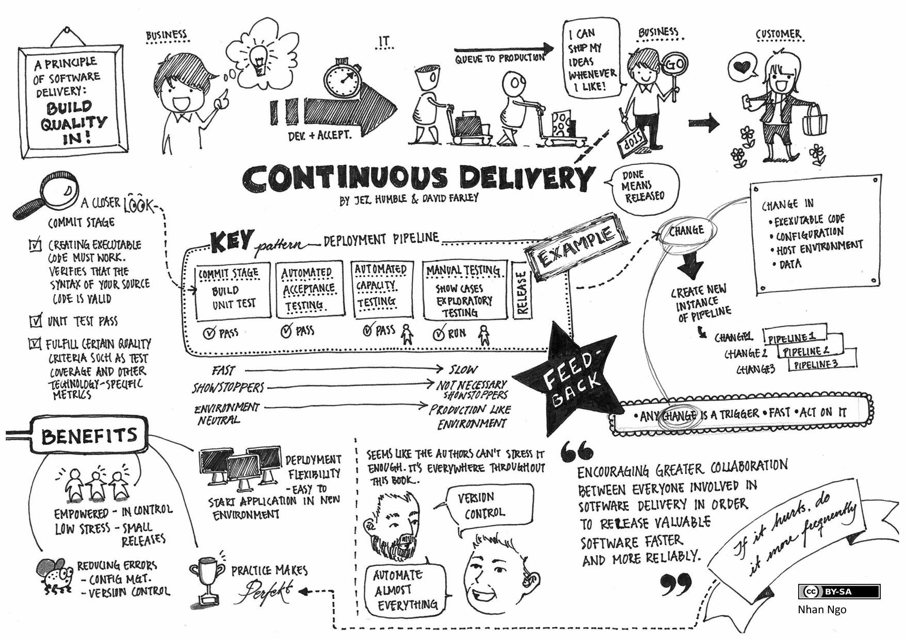

\newpage

## Continuous Delivery

The concept of continuously delivering a product isn’t anything new in the material world.  Demand drives supply, and manufacturing supports the it.  Continuous Delivery[^cd1] of software in practice isn’t really new, but the formal description of the processes is.  Where continuous integration encapsulates a realtime testing function during the development process, continuous delivery practices pick up and focus on the steps required to move the software under development to a deployable state.  There is also the concept of continuous deployment which causes discourse[^cd2] within the community that cares.

 (NOTE:  http://continuousdelivery.com/wp-content/uploads/2014/02/01_CD_the_idea_low-res.jpg)

(Funny illustration, that highlights many of the key points for Continuous Delivery)

Simply put, continuous deployment is the next step - automating the process of moving every new deployable artifact to the "production" environment.  In many cases this could mean a “dark” side, that isn’t available directly to consumers yet.  The deployments can accumulate, and then have a manual operations step that switches the production environment from “dark” to “light”, exposing all of the changes to the consumer.  As the illustration highlights, it is general a business decision - removed from the developers or even operations to make the changes available.  The notion of continuous deployment is better applied to web-based or even mobile applications than some other kinds of software (e.g. embedded, libraries, and components that conform to a specific release cycle) due to the nature of small changes and live updates on servers.

Focusing on continuous delivery for a moment, and accepting that the end state is an artifact that is acceptable for deployment.  For most, this will mean that levels of testing beyond unit and integration are required.  Acceptance Testing is the normal process that verifies (are we building the thing *right?*) and validates (are we building the *right* product?)[^cd3] during the final tasks of a development phase.  In order to make this stream continuous we need to minimize the amount of human effort injected into these tasks.  It might not be easy to completely automate these tasks, but it also might be hard with the introduction of the appropriate tools.  Validation is the tougher of the two - but in actuality it might not be something that needs to be executed with each change, only to do a final release in terms of deployment.  Verification, while simpler from an automation perspective, essentially is dependent on the test harness to do the verification.

[Must read: "IT Managers Guide to Continuous Delivery" - [http://go.xebialabs.com/IT-Managers-Guide-to-CD.html](http://go.xebialabs.com/IT-Managers-Guide-to-CD.html)]

A couple of quick points on acceptance testing as an automation step.  Yes, automated testing does require more development.  But, more importantly, once the tests have been written (and proven) they remove the opportunity for human error - specifically from a regression perspective.  If the verification CAN happen during an every-change process, then it is more likely that the quality of the software under development will stay true - or improve, if the test harness is continuously refined as well.  Documentation, in terms of accurately writing the "definition of done"[^cd4], is extremely important - especially if it is something that can be used to verify the software functionality in an automated way.  This is a great highlight to the importance of the relationship between tools, processes, and the people that use them.

While outside of the scope of this paper, there are various processes and tools worth mentioning that can be defined for enterprise-wide use that help bridge continuous integration with continuous delivery.  Test-Driven Development (TDD)[^cd5] and Behaviour-Driven Development (BDD)[^cd6] have gone a long way to improving the quality of both the software under development and the development processes themselves.  The processes and tools help distribute the ownership for quality across all of the functional players.

While silly this BDD example shows how to write executable/testable functional requirements.  It is language independent so the test can be applied to applications of all different runtimes.

`Feature: Belly`

`  Scenario: a few cukes`

`    Given I have 42 cukes in my belly`

`    When I wait 1 hour`

`    Then my belly should growl`

One potential issue that I want to diffuse quickly - is that achieving continuous delivery isn’t easy, and improving the quality of both the software and the pipeline requires higher organizational IQ.  Yes, there is an investment required to automate functional tests.  Not investing will just create technical and human debt, and without the automation in hand scaling will be painful and costly.  By pushing the testing processes to the front of the lifecycle, quality is embedded into the whole lifecycle, not just a step late in the game.  In addition distributing the responsibility for quality to all of those that touch the solution is the right idea.

One of the paramount aspects to the modern software engineering enterprise is the need to remove the barrier between life-cycle specialists.  Security personnel must be integral to the software design steps - throughout the life of a product or service.  Operations personnel must be involved, early and continuously, working with developers, security, quality assurance to define the requirements from a performance, monitoring and measurement perspective.  Tests and test harnesses require the involvement of all stakeholders, otherwise functional requirements become afterthoughts and thus unmaintainable in a continuous process.

*[**Key point: production/operational requirements, security, delivery, testing, etc. aren’t afterthoughts.  Big engineering firms get it.  IT enterprise project managers don’t.  Need those people involved throughout the development lifecycle.]*

The stream of testing possibilities is fairly limitless.  In many cases lots of different schemes can be run in parallel workflows, reducing the time to final artifact publication.  Performance, penetration, license compliance, target-specific environment, and extended functionality testing can be distributed and managed asynchronously.  It is also possible to external testing - to remote sources (using their APIs) which can help ramp up testing during peak release periods or for new targets.

### Artifact Repositories

Delivery implies that someone transfers something, generally ownership of that something.  Let’s talk through a simple use case, where something is developed in-house and used by multiple development teams downstream.  Independent of the language being used, the development teams need to control their dependencies to prevent transient changes in the composition of their deliverable.  How do they ensure that all developers are working with the same exact configuration?  Most languages have a built-in dependency management tool that is integrated into a build suite.  So they just define the version of the dependency.  But, the build tool needs a centralized location to get the dependency.  Or if the language doesn’t have that capability the developer needs to be able to download it, possible for each target environment where the build happens.  This is also doubly important to ensure that the artifact is indeed the one provided by the true source.  By using a dedicated, and centralized artifact repository each artifact can be signed (rubber stamped as OK) and then consumers can manually or automatically verify the certifier and artifact.

In the landscape of ITIL[^cd7] the idea of an artifact repository is defined as the Definitive Software Library[^cd8].  The repository "ensures that only correctly released and authorized versions are in use."  Seems pretty simple.  But, again it is the combination of tools, process and people that make it reality.

The most common example in the developer landscape is Maven which is both a build tool and the centralized repository for Java.  The central repository is organized by a commercial entity which controls the input into the repository - with a basic adjudication of who is allowed to submit artifacts.  This bellybutton-to-push scheme has seemed to work without issue since its inception.  Maven Central’s network of mirrors has done really well to scale and distribute the dependency fetching process for developers all over the world.  There are a handful of open source and commercial repositories for use on-premise, allowing enterprises to proxy Maven Central and store their own artifacts (including support for many languages beyond just Java).

[More juice needed]

### Release Management

While ITIL describes a need to have a dedicated release manager, I’d have to disagree - as this goes directly against the optimal flow of continuous delivery and realistically isn’t scalable.  This isn’t to say that the practice of release management gets eschewed.  Quite the contrary, release management is an integral piece, however in a modern enterprise we need to be able handle this in an automatable, repeatable, and trackable/auditable way.

[^cd1]:[http://continuousdelivery.com/2014/02/visualizations-of-continuous-delivery/](http://continuousdelivery.com/2014/02/visualizations-of-continuous-delivery/)
[^cd2]:[http://puppetlabs.com/blog/continuous-delivery-vs-continuous-deployment-whats-diff](http://puppetlabs.com/blog/continuous-delivery-vs-continuous-deployment-whats-diff)
[^cd3]:[http://softwaretestingfundamentals.com/verification-vs-validation/](http://softwaretestingfundamentals.com/verification-vs-validation/)
[^cd4]:[https://www.scrum.org/Resources/Scrum-Glossary/Definition-of-Done](https://www.scrum.org/Resources/Scrum-Glossary/Definition-of-Done)
[^cd5]:[http://msdn.microsoft.com/en-us/library/aa730844(v=vs.80).aspx](http://msdn.microsoft.com/en-us/library/aa730844(v=vs.80).aspx)
[^cd6]:[http://dannorth.net/introducing-bdd/](http://dannorth.net/introducing-bdd/)
[^cd7]:[http://www.itil-officialsite.com/aboutitil/whatisitil.aspx](http://www.itil-officialsite.com/aboutitil/whatisitil.aspx)
[^cd8]:[http://itilcollege.com/DefinitiveSoftwareLibraryITIL.html](http://itilcollege.com/DefinitiveSoftwareLibraryITIL.html)
